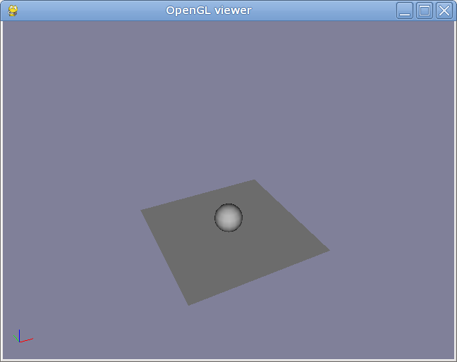
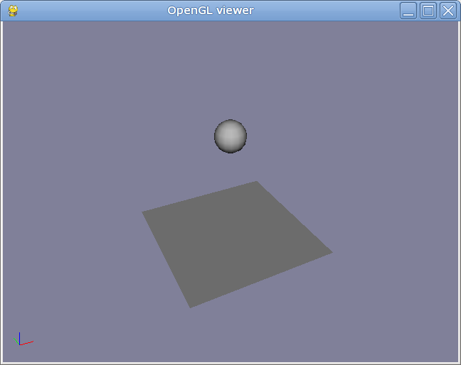

ODEDynamics: Bouncing Sphere
============================

:Author: Alex Dumitrache (alex@cimr.pub.ro)
:Date:  2010/05/05

First steps
~~~~~~~~~~~

Let's create a scene with a sphere and a ground plane::

    odeSim = ODEDynamics(gravity=9.81)
    p = Plane()
    s = Sphere(radius = 0.1, pos = (0,0,1), mass = 1)
    odeSim.add([s, p])

Save this snippet as `sphere.py` and run it using::
    
    > python viewer.py sphere.py
    
You should see a sphere falling down onto a plane. Nice, but... it's not bouncing :(

Instead, it seems to behave like falling onto a sponge...

Adding bounciness
~~~~~~~~~~~~~~~~~

Let's specify some default contact properties::

    defaultContactProps = ODEContactProperties(bounce = 1, mu = 1, soft_erp=0.2, soft_cfm=1E-4)
    odeSim = ODEDynamics(gravity=9.81, defaultcontactproperties=defaultContactProps)
    
    p = Plane()
    s = Sphere(radius = 0.1, pos = (0,0,1), mass = 1)
    
    odeSim.add([s, p])

Save it as `bouncing.py` and run it::

    > python viewer.py bouncing.py

Yay, the ball is bouncing!

Improving accuracy
~~~~~~~~~~~~~~~~~~

The constraint is still soft, so let's improve the simulation accuracy.

We'll lower the time step without changing the frame rate, with `substeps=5`.
This will render one frame every 5 ODE simulation steps::

    defaultContactProps = ODEContactProperties(bounce = 1, mu = 1, soft_erp=0.2, soft_cfm=1E-4)
    odeSim = ODEDynamics(gravity=9.81, 
                         substeps=5,
                         defaultcontactproperties = defaultContactProps)
                         
    p = Plane()
    s = Sphere(radius = 0.1, pos = (0,0,1), mass = 1)
    
    odeSim.add([s, p])

That's better :)

Exercises
~~~~~~~~~

* Try adding a second ball to the simulation.

* Color the balls using `GLMaterial`

* Change the contact properties

* Add a `Box`, a `CCylinder` or try loading a `3ds` / `stl` / `ply` object.

.. image:: pics/twospheres.png

Next steps
~~~~~~~~~~

* Try a more complex :doc:`example <bouncing_spheres_ex>` and play with the parameters.

* Read the next tutorial: :doc:`newton_ball`

Enjoy!

