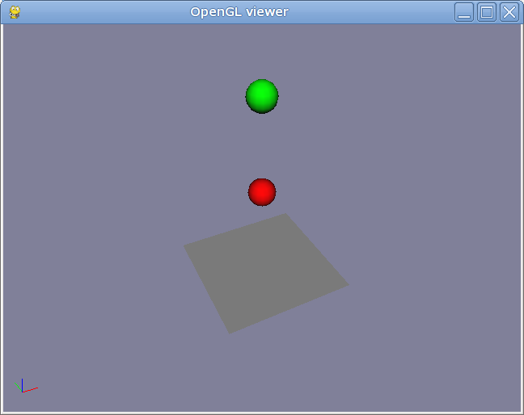

Bouncing Spheres Example
========================

:Author: Alex Dumitrache (alex@cimr.pub.ro)
:Date:  2010/05/05

This is a slightly more advanced example of bouncing spheres, which lets you tweak a lot of settings.

For introduction, see the :doc:`bouncing_sphere` tutorial.

Here is the code::

    # bouncing-spheres.py

    defaultContactProps = ODEContactProperties(bounce = 1, mu = 1, soft_erp=0.2, soft_cfm=1E-4)
    odeSim = ODEDynamics( gravity=9.81, 
                          substeps=5, 
                          cfm=1E-5, 
                          erp=0.2, 
                          defaultcontactproperties = defaultContactProps,
                          use_quick_step = False)

    odeSim.world.setLinearDamping(1e-5)
    odeSim.world.setAngularDamping(1e-5)
    odeSim.world.setMaxAngularSpeed(100)
    odeSim.world.setContactMaxCorrectingVel(100)
    odeSim.world.setContactSurfaceLayer(1E-7)

    matRed = GLMaterial(name="Red", diffuse=(1,0,0))
    matGreen = GLMaterial(name="Green", diffuse=(0,1,0))

    p = Plane()
    s1 = Sphere(radius = 0.1, pos = (0,0,1), mass = 1, material = matRed)
    s2 = Sphere(radius = 0.1, pos = (0,0,1.5), mass = 1, material = matGreen)

    odeSim.add(list(worldroot.iterChilds())) # Add all the cgkit objects to the simulation

Save the snippet as `bouncing-spheres.py` and run it using::

    > python viewer.py bouncing-spheres.py

What do all these parameters and settings do?

* `substeps`: number of ODE steps per displayed frame. 

   ODEDynamics will use a smaller timestep, which results in better accuracy, at the expense of some CPU time.
   
* `use_quick_step = False`

    - This switches to a slower, but usually more accurate `stepping`_ method: `dWorldStep`. 
    - The default is `dWorldQuickStep`. 
    - Differences can be seen only in complex scenes (e.g. stacks of boxes, grasping simulation).

* `cfm`_ and `erp`_ control the softness of constraints, and are explained in detail in the `ODE manual`_. 

    - Lower `cfm` means harder constraints, but can make simulation unstable. Good choices: 1e-4 ... 1e-10.
    - Higher `erp` is more aggressive. Good choices: 0.1 ... 0.5.

* `odeSim.world.set***` 

    These are advances simulation parameters. Check `ODE World functions`_ to see what they do, 
    and use `PyODE API`_ to call them from Python.
    
    Damping and speed limits improve the stability of simulation and can prevent ODE crashes due to numerical errors.

* `matRed = GLMaterial(name="Red", diffuse=(1,0,0))`

    This is the `material` used for rendering the objects. You may use materials for customizing contact properties, too.

.. _Pyode API: http://pyode.sourceforge.net/api-1.2.0/index.html
.. _ODE World functions: http://opende.sourceforge.net/wiki/index.php/Manual_%28World%29
.. _ODE manual: http://opende.sourceforge.net/wiki/index.php/
.. _cfm: http://opende.sourceforge.net/wiki/index.php/Manual_%28Concepts%29#Constraint_Force_Mixing_.28CFM.29
.. _erp: http://opende.sourceforge.net/wiki/index.php/Manual_%28Concepts%29#Joint_error_and_the_error_reduction_parameter_.28ERP.29
.. _stepping: http://opende.sourceforge.net/wiki/index.php/Manual_%28World%29#Stepping_Functions
