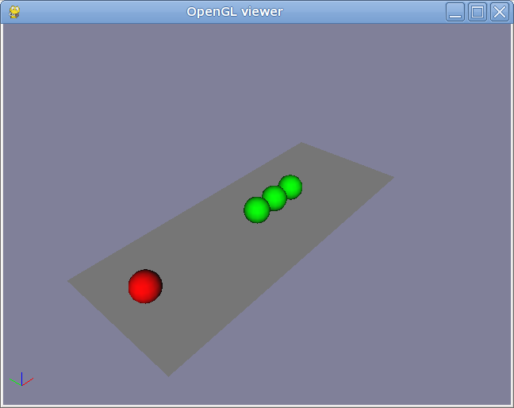
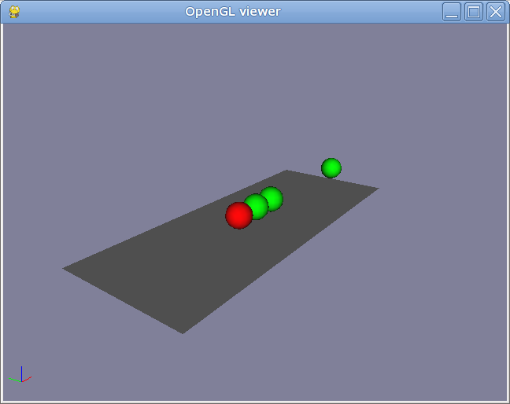

ODEDynamics: Newton Ball Experiment
===================================

:Author: Alex Dumitrache (alex@cimr.pub.ro)
:Date:  2010/05/05

In this tutorial you will create a simplified version of `Newton's Cradle`_.

You will also learn how to apply forces to objects in the scene.

Initializing
~~~~~~~~~~~~

Let's set some contact properties and simulation parameters::

    defaultContactProps = ODEContactProperties(bounce = 1, mu = 1, soft_erp=0.5, soft_cfm=1E-10)
    odeSim = ODEDynamics(gravity=9.81, substeps=100, defaultcontactproperties = defaultContactProps, use_quick_step = False)

We would also like some colorful balls::

    matRed = GLMaterial(name="Red", diffuse=(1,0,0))
    matGreen = GLMaterial(name="Green", diffuse=(0,1,0))

Now let's create a ground plane, one red ball and 3 green balls::

    p = Plane(lx=2.5, ly=1)
    s  = Sphere(radius = 0.1, pos = ( -1, 0, 0.1), mass = 1, material = matRed)
    s1 = Sphere(radius = 0.1, pos = (  0, 0, 0.1), mass = 1, material = matGreen)
    s2 = Sphere(radius = 0.1, pos = (0.2, 0, 0.1), mass = 1, material = matGreen)
    s3 = Sphere(radius = 0.1, pos = (0.4, 0, 0.1), mass = 1, material = matGreen)
    odeSim.add(list(worldroot.iterChilds()))

Save all these 3 snippets as `newton-ball.py` and run the code. You should see this:

Ready to hit the red ball?

To apply a force or an impulse to an object, you should use its `ODEBodyManipulator`, which is
available using `obj.manip`. 

We will use `addForce` method, like this::

    obj.manip.addForce((fx,fy,fz))
    
If you call addForce once, it will behave like an *impulse*! The force will be applied in a
single time step (of course, during all its substeps).

To specify a continuous force, e.g. similar to gravity, you have to call `addForce` in
the `STEP_FRAME` event handler. You will see this in the :doc:`falling_boxes` tutorial.

For our red ball, the impulse is OK. We will define a keyboard event handler, to handle these keys:

* **H** = hit the red ball
* **R** = reset the simulation

.. code-block:: python

    def onKeyPress(K):  
        if K.key.lower() == 'h':
            s.manip.addForce((100,0,0))
        if K.key.lower() == 'r':
            eventmanager.event(RESET)
            
    eventmanager.connect(KEY_PRESS, onKeyPress)

    print """
    Press H to hit the balls
    Press R to restart the simulation
    """
            
Add this last snippet to `newton-ball.py` and run it again. Press **H** and enjoy!

You may also download the complete script :download:`newton-ball.py <files/newton-ball.py>`.

Exercises
~~~~~~~~~

* Try setting *mu* to 0, to 1000, and then to `ode.Infinity` to see what happens!
    
* Try setting *substeps* to 1, 5, 1000 and 5000. Also try to switch between `quickStep` and `step`.

Next steps
~~~~~~~~~~

* Try a more realistic :doc:`example <newton_cradle_ex>` of the Newton's Cradle, and play with the simulation parameters.

* Try to simulate the opening break shot in a billiard game. If the result is nice, please send it to us :)

* Read the next tutorial: :doc:`falling_boxes`.

.. _Newton's Cradle: http://en.wikipedia.org/wiki/Newton%27s_cradle
