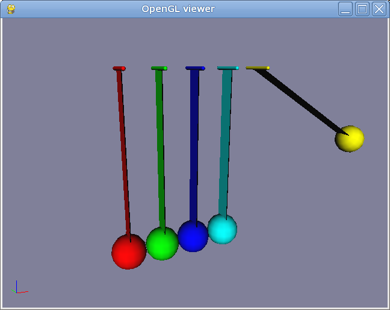

Newton Cradle Example
=====================

:Author: Alex Dumitrache (alex@cimr.pub.ro)
:Date:  2010/05/05

This is an interactive example of Newton's Cradle.

For a simplified version, see the :doc:`newton_ball` tutorial.

Here is the code::

    # Newton's Cradle

    # First, some useful functions
    def rx(ang):
        return mat3(1).rotate(ang, (1,0,0))
    def ry(ang):
        return mat3(1).rotate(ang, (0,1,0))
    def rz(ang):
        return mat3(1).rotate(ang, (0,0,1))

    def remove(objs):
        objs = worldObjects(objs)
        
        for o in objs:
            for c in o.iterChilds():
                remove(c)
            for s in getScene().items:
                if type(s) == ODEDynamics:
                    try: s.remove(o)
                    except: pass
                if type(s) == cgkit._core.WorldObject:
                    try: s.removeChild(o)
                    except: pass

    # Adjust contact properties and simulation parameters
    defaultContactProps = ODEContactProperties(bounce = 1, mu = 1, soft_erp=0.5, soft_cfm=1E-10)
    odeSim = ODEDynamics( gravity=9.81, substeps=20, defaultcontactproperties = defaultContactProps, use_quick_step = False)

    # Define materials
    matRed     = GLMaterial(name="Red",     diffuse=(1,0,0))
    matGreen   = GLMaterial(name="Green",   diffuse=(0,1,0))
    matBlue    = GLMaterial(name="Blue",    diffuse=(0,0,1))
    matCyan    = GLMaterial(name="Cyan",    diffuse=(0,1,1))
    matMagenta = GLMaterial(name="Magenta", diffuse=(1,0,1))
    matYellow  = GLMaterial(name="Yellow",  diffuse=(1,1,0))
    matOrange  = GLMaterial(name="Orange",  diffuse=(1,0.5,0))
    matWhite   = GLMaterial(name="White",   diffuse=(1,1,1))
    matGray    = GLMaterial(name="Gray",    diffuse=(0.5,0.5,0.5))
    matBlack   = GLMaterial(name="Black",   diffuse=(0,0,0))
    materials  = [matRed, matGreen, matBlue, matCyan, matYellow, matOrange, matMagenta, matWhite, matGray, matBlack]

    # The cradle is made of balls, pins and hinge joints
    balls = []; pins = []; hinges = []
    def createNewCradle(n):
        global balls, pins, hinges

        print "Creating a cradle with %d balls..." % n

        # Remove existing objects from the scene and create the cradle from scratch
        remove(balls + pins + hinges)
        balls = []; pins = []; hinges = []
        
        # Create 'n' balls and pins, then connect them with hinge joints
        for i in range(n):
            x = (i-n/2.0) * 0.2
            balls.append(Sphere(radius = 0.1, pos = (x, 0, 0), mass = 1, material = materials[i]))
            pins.append(CCylinder(radius = 0.01, length = 0.2, rot = rx(pi/2), pos = (x, 0, 1), mass = 1, material = materials[i]))
            hinges.append(ODEHingeJoint("Hinge 1", pins[-1], balls[-1], pos = pins[-1].pos, rot = rz(pi/2)))

        # Add the bodies to the simulation, and then add the joints
        odeSim.add(balls + pins)
        odeSim.add(hinges)

        # Add Box decorations for each ball (only for rendering, do not add them to ODEDynamics)
        for i, s in enumerate(balls):
            x = (i-n/2.0) * 0.2
            b = Box(pos = (x, 0, 0.5), lx = 0.005, ly = 0.1, lz = 1, material=materials[i])
            link(b, s)
        
        # Fix all the pins here
        for p in pins:
            p.manip.odebody.setKinematic() 
        
    # By default, create a cradle with 4 balls
    createNewCradle(4)

    # Key press handler
    def onKeyPress(K):  
        if K.key > '0' and K.key <= '9':
            createNewCradle(int(K.key))
        if K.key.lower() == 'h':
            balls[0].manip.addForce((-100,0,0))
        if K.key.lower() == 'r':
            eventmanager.event(RESET)

    eventmanager.connect(KEY_PRESS, onKeyPress)

    print """
    Press H to apply an impulse to the red ball
    Press R to restart the simulation
    Press 1...9 to change the number of balls
    """

    # That's it :)

Download the :download:`script <files/newton-cradle.py>` and run it using::

    > python viewer.py newton-cradle.py
    
Apply an impulse to the red balls with **H** key, change the number of balls with **1** ... **9** and reset the simulation with **R**.

Now let's break the code into pieces:

* First, we define some useful functions:
    - `rx`, `ry` and `rz` are elementary rotations
    - `remove` will clean up the scene and allow us to regenerate the cradle from scratch

* Then, the contact properties are defined. 
    - The most important is *bounce = 1*. 
    - Also, you have to set *mu=1*, although in real physics, *mu* should not have any influence. 
   
* `ODEDynamics` parameters:
    -  `substeps` is also important here. For best results, set it to high values.

    - `cfm` and `erp` are not very important, so you may also stick with the defaults here. 
 
* Materials: it is a list of `GLMaterial` objects; one color for each ball. 

* `createNewCradle(n):`
   
   The cradle contains `n` balls, each ball being connected to a fixed pin using a hinge joint. 
   
   Steps for creating a new cradle:
   
   - Remove previous cradle from the scene
   - Create `n` balls, pins and hinge joints between each ball-pin pair
   - Add the bodies and the joints to the `ODEDynamics` component
   - Create `n` boxes, which will show the links between each ball and pin
   - Use the boxes only for rendering, and attach them to the balls using cgkit function `link`
   - Lock the position of the pins by setting the kinematic state flag for them

* By default, create a cradle with 4 balls

* Add a handler for keyboard events (keys *H*, *R* and *1* ... *9*)

* Don't forget to display a short usage help :)

Whew!
